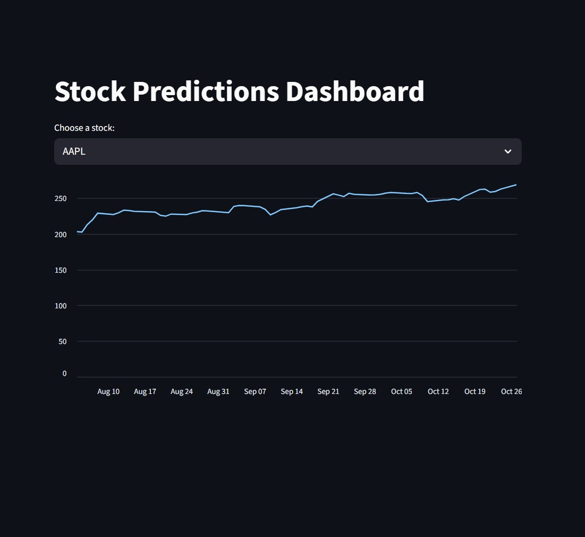
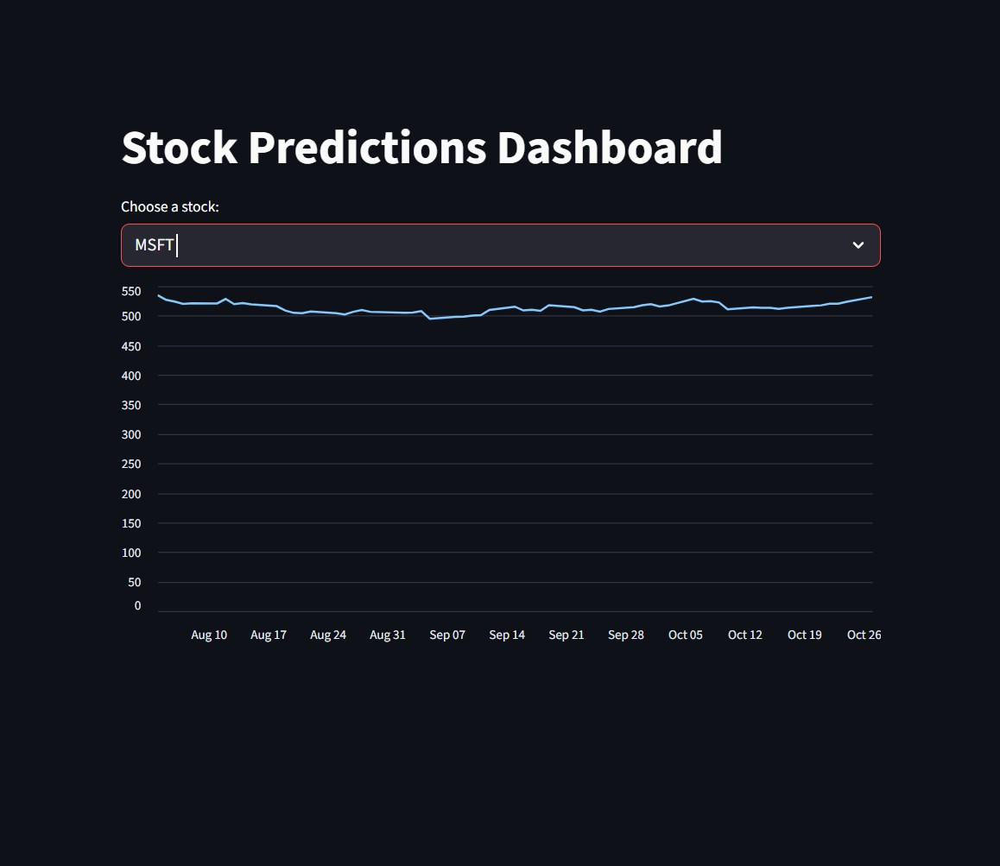
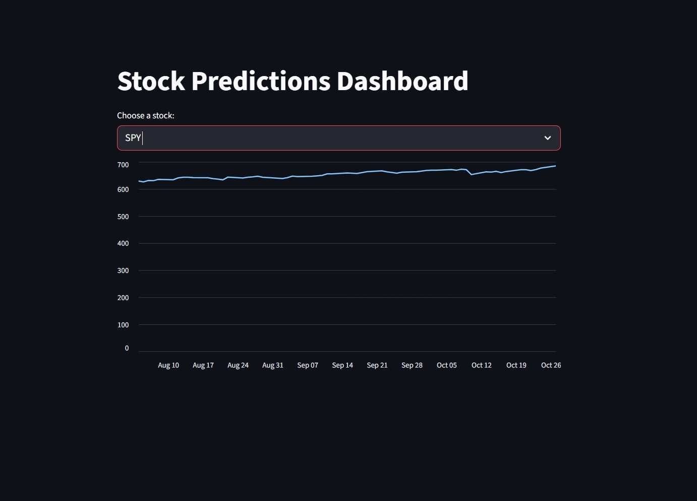

## Frontend Research

Goal: Start a basic Streamlit app that loads our predictions.json and plots the prices

## How I ran this project:

python -m venv venv

source venv/bin/activate     # Mac/Linux  
venv\Scripts\activate        # Windows

pip install -r requirements.txt

streamlit run app.py

## Output

It loads predictions.json, lets the user pick a ticker, and plots that ticker’s closing prices over time

Below are screenshots of the 3 different graphs this dashboard shows:

  
  
  

